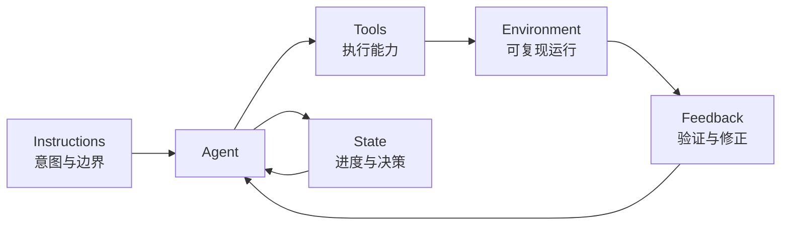

# Learn Harness Engineering：从模型能力到可靠交付
Harness 的目标不是让模型变聪明，而是让已有能力能够稳定转化为可验证的结果。
它由模型之外的工作系统组成：指令、工具、环境、状态和反馈。代码 agent 是否可靠，往往取决于这五部分能否形成闭环。
本文将原始研究笔记压缩为一个五子系统模型和一条端到端执行流程，重点回答三个问题：
- agent 为什么会在看似简单的任务中失败？
- 仓库需要提供哪些最小基础设施？
- 怎样判断一次任务和一次会话真正完成？
## 1. Harness 解决什么问题
模型能力和执行可靠性不是同一件事。
模型可能理解需求、能写出局部正确的代码，却因为上下文缺失、环境不可复现、任务边界模糊或验证不足而交付失败。
这类失败不应立即归因于“模型不够强”。更有价值的做法是检查模型之外的执行系统：
1. **Instructions**：任务、约束和完成标准是否清楚？
2. **Tools**：agent 是否能读取、修改、运行和检查项目？
3. **Environment**：依赖、版本和服务是否可复现？
4. **State**：当前进度、决策和阻塞是否被持久化？
5. **Feedback**：agent 是否能看到足够具体的验证结果？
### 1.1 Harness-first 诊断
遇到失败时，使用下面的循环：
```text
执行任务
  -> 观察具体失败
  -> 定位到某个 harness 子系统
  -> 修补该子系统
  -> 重新执行并验证
```
例如，“添加搜索功能”不是可执行的完成定义。更好的描述是：
```text
行为：
- GET /api/search?q=<keyword> 返回匹配结果
- 默认每页 20 条，并返回总数
- 空查询返回 400
验证：
- 搜索接口集成测试通过
- 类型检查通过
- 从用户输入到结果展示的主流程通过
```
完成标准必须能够产生证据。只描述要写什么，agent 容易把“代码存在”误认为“功能完成”。
### 1.2 最小原则
好的 harness 不是规则越多越好，而是以最小成本消除当前最重要的不确定性。
每个组件都应该回答：
- 它防止哪类真实失败？
- agent 会在什么时候读取或使用它？
- 删除它以后，结果是否明显变差？
如果一个组件没有影响决策、执行或验证，就应当简化或删除。Harness 也会产生维护成本和上下文成本。
## 2. 五个核心子系统
五个子系统不是五套独立文档，而是一个闭环中的不同职责。

### 模型层级
五个子系统描述 Harness 由什么组成，它们是本项目唯一的一级模型。
Lifecycle 描述五个子系统协同工作的时间顺序。Scope Control 是跨系统约束，
Verification 是 Feedback 产生证据的主要过程；三者都是运行机制，不与子系统并列。
现有 `harness-creator` 的五维模型统一映射如下：
| 原概念 | 规范模型中的位置 |
|---|---|
| Instructions | Instructions |
| State | State |
| Verification | Feedback 的主要过程 |
| Scope | Instructions + State + Feedback |
| Lifecycle | 跨子系统执行流程 |
Tools 和 Environment 补齐原模型没有独立表达的执行能力与运行条件。
### 2.1 Instructions：表达意图与不变量
指令子系统告诉 agent：这是什么项目、怎样开始、哪些规则不能违反、什么叫完成。
根级 `AGENTS.md` 应当是路由器，而不是百科全书。它只需要包含：
- 一两句项目定位；
- 标准启动和验证命令；
- 少量全局硬约束；
- 指向专题文档和状态文件的链接。
示例：
```markdown
# Agent Operating Contract
## 快速开始
- 初始化：`./init.sh`
- 当前范围：读取 `feature_list.json`
- 会话状态：读取 `progress.md`
## 工作规则
- 同时只推进一个功能项
- 修改后运行功能对应的验证
- 没有执行证据，不得声明完成
## 深入阅读
- 项目语言：`CONTEXT.md`
- 演进记录：`docs/evolution/`
```
当入口文件不断增长时，优先把专题内容移动到对应模块或 `docs/`，并保留带适用条件的链接。
失败信号包括：agent 不知道从哪里开始、忽略关键规则、重复读取无关材料，或不同会话采用互相冲突的约定。
### 2.2 Tools：提供必要的执行能力
工具子系统让 agent 能够把推理变成操作，并获取结果。
最小工具面通常包括：
- 搜索和读取文件；
- 编辑文件；
- 执行 shell 命令；
- 运行测试、lint、类型检查和构建；
- 在需要时检查浏览器、日志或运行时状态。
权限应匹配任务风险。过度限制会让 agent 无法验证，过度开放则扩大误操作范围。
判断工具是否足够，不看工具数量，而看 agent 能否独立完成“检查现状、实施修改、运行验证、读取失败、继续修正”。
### 2.3 Environment：让运行条件可复现
环境子系统负责运行时版本、依赖、配置和外部服务。
最小环境描述应尽可能由机器可读文件提供：
- `package.json`、`pyproject.toml` 等依赖清单；
- `.nvmrc`、`.python-version` 等运行时版本；
- lockfile；
- `.env.example`；
- Docker、devcontainer 或明确的本地启动命令。
环境应当自描述。新会话不应该依赖某位工程师记得“先手动启动一个服务”。
常见失败信号是：本地能跑但新环境不能跑、测试依赖隐式服务、版本不同导致结果漂移，或初始化命令不幂等。
### 2.4 State：保存跨步骤和跨会话状态
状态子系统回答：
- 现在正在做什么？
- 已经完成了什么？
- 哪些验证通过或失败？
- 为什么采用当前方案？
- 下一步是什么？
适合持久化的工件包括：
- `feature_list.json`：范围、依赖、状态和完成证据；
- `progress.md`：当前进展、验证和阻塞；
- `session-handoff.md`：较大任务的重启路径；
- Git commit：原子化检查点；
- ADR 或演进记录：值得长期保留的决策理由。
不是每次思考都要记录。只持久化下一会话无法安全推断、并且会影响后续决策的信息。
### 2.5 Feedback：把失败变成下一步
反馈子系统决定 agent 能否发现错误并自主修正。
反馈应当：
- 来自真实执行，而不是主观自评；
- 尽可能靠近失败位置；
- 说明发生了什么、为什么重要、下一步去哪里检查；
- 区分静态错误、局部行为错误和系统级错误。
例如，与其只返回 `Test failed`，更好的错误是：
```text
POST /api/reset-password returned 500.
Expected the email adapter to be configured before the handler runs.
Check the test environment and the adapter initialization path.
```
反馈是投入产出比最高的子系统之一，因为它让一次失败成为可复用的修正信号。
## 3. 让仓库成为唯一事实来源
对 agent 不可见的信息，不能稳定参与决策。
如果关键约束只存在于聊天、工单、会议记录或某个人的记忆里，新会话就必须重新猜测。
### 3.1 Fresh-session test
打开一个全新会话，只允许读取仓库，检查它能否回答：
1. 这是什么项目？
2. 项目怎样组织？
3. 怎样初始化和运行？
4. 怎样验证修改？
5. 当前做到哪里，下一步是什么？
这五个问题构成仓库地图的最低验收标准。
### 3.2 知识放置原则
**靠近使用位置。** 全局规则放根入口；模块约束放模块附近；运行命令放标准脚本或配置；阶段结论放演进记录。
**最小但完备。** 删除不影响决策的信息，但必须覆盖 fresh-session test。
**渐进展开。** 入口文件给方向，专题文档给细节，代码和配置给最终事实。
**与代码共同更新。** 过时的说明会主动误导 agent，风险可能高于没有说明。
### 3.3 用 ACID 类比管理状态
- **Atomicity**：一个逻辑工作单元形成一个可回退的检查点。
- **Consistency**：修改前后都能通过定义好的验证谓词。
- **Isolation**：并行工作使用独立分支、worktree 或独立状态文件。
- **Durability**：跨会话需要的信息写入 Git 跟踪的工件。
这个类比不是要求把仓库变成数据库，而是提醒我们避免“做了一半但没人知道”的中间状态。
## 4. 用单一功能驱动执行
Agent 容易同时启动多个相关任务，最终留下大量修改，却没有一个用户行为真正跑通。
最安全的默认值是 `WIP=1`：任何时候只有一个功能项处于执行状态。
### 4.1 功能项的最小结构
每个功能项至少包含：
- **Behavior**：用户或系统可观察的行为；
- **Verification**：证明行为成立的命令或步骤；
- **State**：当前所处状态；
- **Evidence**：验证结果、提交或产物。
示例：
```json
{
  "id": "feat-search",
  "behavior": "GET /api/search returns paginated matches",
  "verification": "pytest tests/api/test_search.py -q",
  "state": "passing",
  "evidence": "18 tests passed; commit abc1234"
}
```
建议使用简单状态机：
```text
not-started -> in-progress -> done
                     |
                     -> blocked
```
从 `in-progress` 到 `done` 的门槛不是代码量，也不是 agent 的信心，而是验证成功并记录证据。
### 4.2 粒度与边界
一个功能项应当能在一次正常会话中完成并验证。
“实现购物车”通常太粗；“用户可以添加一个有库存的商品，并看到更新后的数量”更容易验证。
范围还应明确排除项。例如实现搜索接口时，不顺便重构认证模块，不提前做性能优化，不修改无关样式。
如果发现必要的相关工作，应先记录依赖或新功能项，再完成当前项。
### 4.3 执行流程

这条流程同时控制 overreach 和 under-finish：不允许同时铺开太多，也不允许未验证就结束。
## 5. 用反馈闭环定义完成
Agent 的自我评价不能替代执行证据。
“代码已写完”“看起来正确”“单元测试通过”都只是中间信号。完成必须由任务风险对应的验证层级决定。
### 5.1 分层验证
```text
层 1：静态检查
- 格式、lint、类型检查、结构约束
层 2：局部与集成行为
- 单元测试、集成测试、应用启动和健康检查
层 3：系统级行为
- 端到端流程、真实依赖、关键副作用和用户场景
```
并非每个文档修改都需要 E2E，也并非每个跨组件功能只跑 lint 就够了。
验证层级应由变更影响面决定，并在开始工作前写进功能项或任务合同。
### 5.2 单元测试的边界
单元测试擅长定位局部逻辑错误，但它通过隔离依赖获得速度，因此看不到某些系统问题：
- 组件接口不匹配；
- 配置或环境差异；
- 跨层状态传播；
- 资源生命周期和真实副作用；
- 用户路径没有真正连通。
涉及多个组件时，应增加集成或端到端证据。
### 5.3 完成定义
一次任务完成，需要同时满足：
- 目标行为存在；
- 约定的验证全部通过；
- 失败或跳过项被明确记录；
- 功能状态和证据已更新；
- 没有无关改动或临时调试工件；
- 仓库仍能通过标准启动路径进入。
核心功能通过以前，不应进行无关重构。先完成，再优化。
### 5.4 把重复反馈提升为规则
同类问题多次出现在 review 中时，可以逐级提升：
1. 写入模块附近的约束；
2. 改进测试失败信息；
3. 增加测试或 lint；
4. 编码为自动化检查。
目标不是不断增加规则，而是让高频人工判断转化为低成本、可重复的反馈。
## 6. 保持跨会话连续
上下文窗口总会结束。可靠的长任务不能依赖对话永久保存。
跨会话连续性的核心，是让下一会话能够快速重建“事实、原因、证据和下一步”。
### 6.1 初始化
新会话开始时：
```text
1. 读取 README.md 和 AGENTS.md
2. 读取 feature_list.json 和 progress.md
3. 必要时读取 session-handoff.md
4. 运行 ./init.sh 或项目标准检查
5. 从唯一的 in-progress 或 next 功能继续
```
初始化的目标不是立刻写代码，而是确认仓库处于可执行的一致状态。
一个项目至少应做到：能初始化、能验证、能看见当前进度、能确定下一步。
### 6.2 记录决策与进度
`progress.md` 记录会变化的会话状态；ADR 或演进记录保存长期有价值的原因。
记录“为什么”时保持克制。只有当未来维护者可能做出不同选择，并且错误选择代价明显时，才值得形成长期决策文档。
Git commit 是天然的状态检查点。提交应对应完整、可解释、已验证的逻辑单元。
### 6.3 清洁交接
会话结束前：
```text
1. 运行任务对应的验证
2. 更新功能状态和验证证据
3. 更新 progress.md
4. 为未完成的大任务更新 session-handoff.md
5. 清理临时文件和调试代码
6. 确认标准初始化路径仍可用
```
如果任务没有完成，应准确记录剩余问题和复现方式，而不是用“基本完成”掩盖不确定性。
交接质量决定下一会话的重建成本。好的交接让下一位 agent 继续执行，而不是重新考古。
### 6.4 定期简化 Harness
Harness 是适应当前模型能力和项目风险的工程结构，不应永久冻结。
定期检查：
- 哪些规则已经被自动化检查覆盖？
- 哪些文档不再影响决策？
- 哪些状态文件重复表达同一事实？
- 哪些验证仍然捕获真实缺陷？
可以暂时移除一个组件，在相同任务上比较完成时间、验证通过率、返工次数和会话数量。如果结果没有退化，就保留更简单的结构。

本仓库的首个四任务 pilot 提供了一个克制的反例：在微小、边界清晰、单会话任务
中，bare 与 harness 条件都首次实现即通过，harness 反而增加了读取、验证和状态
更新操作。它的可见收益是留下 machine-readable done/evidence，而不是已证明的
速度提升。

因此 Harness 有固定协调成本。应根据任务规模、风险和跨会话需求选择最小表面，
而不是默认文件越多越成熟。一次同 agent 的合成实验只能形成 `observed` 结论；
独立 fresh-session 重复以前，不应晋级为 level 3 或强诊断规则。
## 7. 最小落地路径
不需要一次建设完整平台。先建立最小闭环，再根据真实失败增加能力。
### 7.1 第一阶段：让项目可进入
- 建立短 `AGENTS.md`；
- 提供一个标准初始化命令；
- 锁定依赖和运行时；
- 确保至少一条验证命令可运行。
### 7.2 第二阶段：让任务可完成
- 建立机器可读的功能清单；
- 每次只激活一个功能；
- 为功能写行为和验证；
- 只有验证通过才能更新为完成。
### 7.3 第三阶段：让项目可持续
- 记录进度、阻塞和下一步；
- 为重要决策保留原因；
- 建立会话退出检查；
- 把重复 review 反馈提升为自动化检查；
- 定期删除不再产生价值的 harness 组件。
### 7.4 当前仓库映射
本仓库已经具备：
- `AGENTS.md`：短根操作合同；
- `feature_list.json`：功能范围和状态；
- `progress.md`：会话连续性；
- `session-handoff.md`：重启路径；
- `init.sh`：结构和启动检查；
- `docs/evolution/`：阶段性证据。
- `packages/harness-core/`：五子系统 shared contract 与 Readiness inspector；
- `skills/harness-creator/`、`skills/harness-doctor/`：创建与诊断双入口；
- `scripts/package-harness-plugin.mjs`：生成自包含 `harness-engineering` plugin；
- `experiments/field-validation/`：受控任务协议与 observed pilot 证据。

下一步重点不是增加更多默认工件，而是提高 Effectiveness 证据质量：
1. 用独立 fresh-session agent 重复任务，降低同 agent 与顺序偏差；
2. 使用更接近真实项目的多文件、跨会话任务；
3. 预先定义成功率、返工、恢复成本和停止条件；
4. 只有重复证据稳定后，才把观察晋级为 creator/doctor 规则。
### 7.5 最终检查清单
一个最小但可靠的 harness 应当让全新会话回答：
- 我正在维护什么系统？
- 当前唯一任务是什么？
- 哪些规则不能违反？
- 怎样初始化和执行？
- 怎样证明任务完成？
- 失败时能否得到可操作反馈？
- 会话结束后，下一位 agent 能否直接接手？
如果这七个问题都有仓库内、可验证、不过时的答案，harness 就已经形成了基本闭环。
