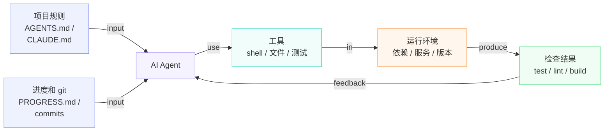
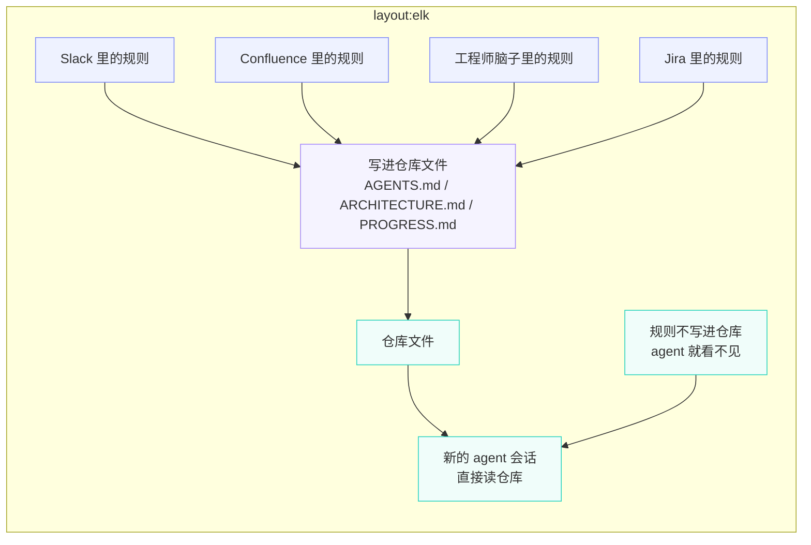
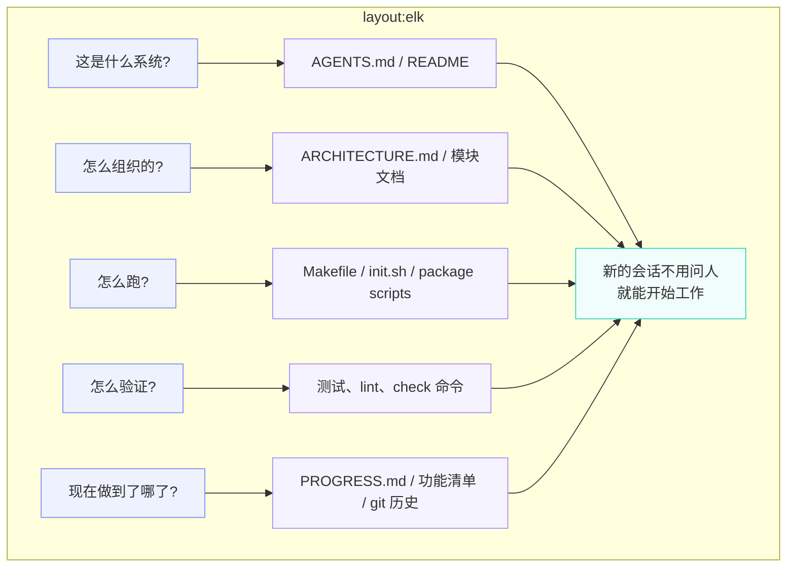
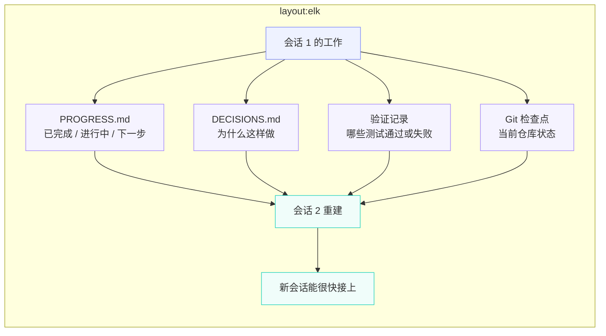
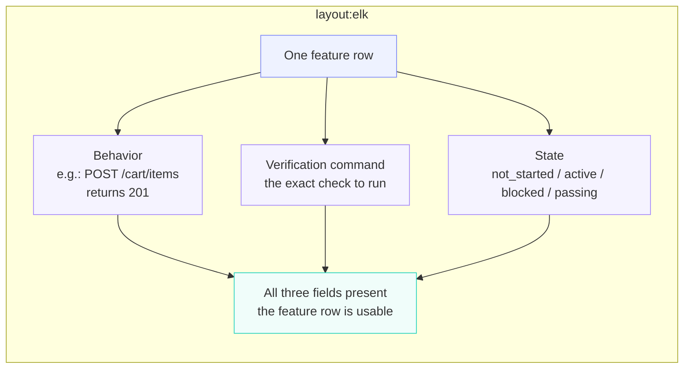
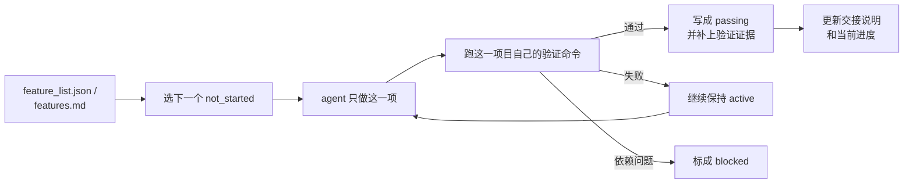
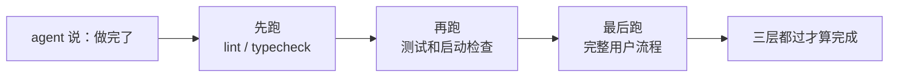
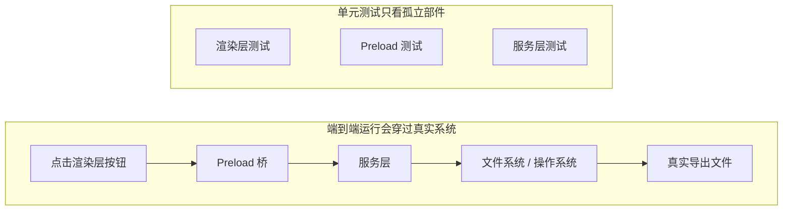
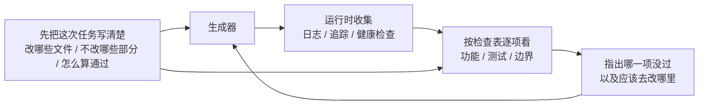

# Learn Harness Engineering 笔记

Harness 的本质不是“让模型变聪明”，而是给模型建立一套闭环的工作系统。你可以通过下面的简单图示理解它的核心运作流：


## 1. 模型能力强，不等于执行可靠

- 能力鸿沟（Capability Gap）：模型在基准测试上的表现和真实任务上的表现之间的巨大落差。SWE-bench Verified 上 50-60% 的通过率意味着近一半的真实 issue 解不了。
- Harness：模型之外的一切——指令、工具、环境、状态管理、验证反馈。不是模型权重的部分，全是 harness。也就是我们说的"马具"。
- Harness 诱导失败：模型本身能力足够，但因为执行环境有结构性缺陷而失败。Anthropic 的对照实验已经证明了这一点。
- 验证缺口：agent 对自己输出的信心评估和实际正确性之间的偏差。agent 说"我做完了"但实际没做完——这是最常见的失败模式。
- 诊断循环：执行 → 观察失败 → 定位到 harness 的哪一层出了问题 → 修补那一层 → 重新执行。这是 harness 工程的核心方法论。
- 完成定义（Definition of Done）：一组可以用命令验证的条件——测试通过、lint 没报错、类型检查通过。没有显式的完成定义，agent 就会自己编一个。

### 1.1 遇到失败，先修 harness

核心原则只有一条：遇到失败，先别换模型，先检查 harness。 如果同一个模型在类似的结构良好的任务中能成功，那优先假设是 harness 的问题。

给每个任务写显式的完成定义。不要说"加个搜索功能"，要说清楚：

```
完成标准：
- 新增 GET /api/search?q=xxx 端点
- 支持分页，默认 20 条
- 返回结果包含高亮片段
- 所有新代码通过 pytest
- 类型检查通过（mypy --strict）
```

### 1.2 核心要点

- 模型能力和执行可靠性是两回事，千里马也得配上好马具。
- 失败的时候先看 harness，再看模型。换模型是成本最高的选择，而且很多时候根本不是模型的问题。
- 每次失败都是一个信号：你的 harness 有结构性缺陷。把它找出来、修掉。
- 遇到失败不要笼统地说"模型不行"。任务没交代清楚、上下文不够、环境没配好、验证手段缺失、上一个会话做到哪了新会话接不上，五个地方逐个排查，问题十有八九出在其中一层。
- 一个 AGENTS.md 文件可能比你换一个更贵的模型更有效。


## 2 Harness 到底是什么

harness 由五个子系统组成：指令、工具、环境、状态、反馈。每个子系统都有明确的职责和评判标准。


### 2.1 核心概念

- 什么是 harness：模型权重之外的一切工程基础设施。OpenAI 把工程师的核心工作概括为三件事：设计环境、表达意图、构建反馈循环。Anthropic 直接把 Claude Agent SDK 称为"通用 agent harness"。
- 仓库是唯一事实来源：agent 看不到的东西，对它来说就不存在。OpenAI 把仓库当作"记录系统"，所有必要的上下文都必须在仓库里，通过结构化的文件和清晰的目录组织来呈现。
- 给地图，不给说明书：OpenAI 的经验是 AGENTS.md 应该是目录页，不是百科全书。100 行左右就够了，放不下就拆分到 docs/ 目录里，让 agent 按需去读。
- 约束而非微操：好的 harness 用可执行的规则来约束 agent，而不是在指令里逐条叮嘱。OpenAI 说"执行不变量，不要微管实现"；Anthropic 发现 agent 会自信地夸赞自己的工作，解决方案是把"干活的人"和"检查的人"分开。
- 逐个移除看效果：想量化 harness 各组件的边际贡献，就逐个移除，看哪个移除后性能下降最多。它能告诉你哪些组件当前最有价值，也能暴露哪些组件暂时贡献不明显。Anthropic 用这个方法发现：随着模型变强，某些组件不再关键，但总会有新的关键组件出现。


### 2.2 Harness 五子系统模型



- 指令子系统：创建 AGENTS.md（或 CLAUDE.md），内容包括项目概览和目的、技术栈和版本、首次运行命令、不可违反的硬约束、指向更详细文档的链接。

- 工具子系统：确保 agent 有足够的工具访问权限。不要因为"安全考虑"把 shell 给禁了，agent 连 pip install 都跑不了，还怎么干活？但也别什么都开放，按最小权限原则来。

- 环境子系统：让环境状态自描述。用 pyproject.toml 或 package.json 锁定依赖，用 .nvmrc 或 .python-version 指定运行时版本，用 Docker 或 devcontainer 让环境可重现。

- 状态子系统：长任务必须有进度跟踪。用一个简单的 PROGRESS.md 文件记录：哪些做完了，哪些在做，哪些被阻塞。每个会话结束前更新，下一个会话开始时读取。

- 反馈子系统：这是投入产出比最高的子系统。在 AGENTS.md 里显式列出验证命令：

```
验证命令：
- 测试：pytest tests/ -x
- 类型检查：mypy src/ --strict
- Lint：ruff check src/
- 完整验证：make check（包含以上全部）
```


## 3 让代码仓库成为唯一的事实来源


### 3.1 知识可见性



怎么检验你的地图画得够不够好？做一个"全新会话测试"：开一个全新的 agent 会话，只让它看仓库内容，看它能不能回答五个基本问题。



### 3.2 核心概念

- 知识可见性缺口：项目总知识中不在仓库里的比例。缺口越大，agent 失败的概率越高。你可以这样估算：把脑子里关于这个项目的隐性知识全算上，再看有多少写进了仓库，两者的差距就是可见性缺口。
- 系统记录（System of Record）：代码仓库作为项目决策、架构约束、执行状态和验证标准的权威信息源。仓库说了算，别的地方说了不算。如果"此路不通"这个信息只在老张的脑子里，那每次都得问老张。写进仓库，谁都不用问。
- 全新会话测试：上一节说的五个问题。能回答几个，你的地图就画了几分。
- 发现成本：agent 为了在仓库里找到一条关键信息需要消耗多少上下文。信息放得越隐蔽，发现成本越高，留给实际任务的预算越少。关键信息应该放在 agent 最先看到的位置，而不是藏在十层目录深处。
- 知识衰减率：仓库中单位时间内变得过时的知识条目比例。文档和代码脱节是最大的敌人，比没有文档更危险的是过时的文档。
- ACID 类比：把数据库的事务管理原则（原子性 Atomicity、一致性 Consistency、隔离性 Isolation、持久性 Durability）用到 agent 的状态管理上。后面会展开讲。

### 3.3 怎么画好这张地图

- 原则 1：知识靠近代码。 一条关于 API 端点认证的规则，应该放在 API 代码旁边，而不是藏在一个巨大的全局文档里。每个模块目录下放一个简短的文档，说清楚这个模块的职责、接口和特殊约束。模块目录本身就是天然的索引，agent 读到代码就能读到约束，不用到处翻找。

- 原则 2：用标准化的入口文件。 AGENTS.md（或 CLAUDE.md）是 agent 的"着陆页"。它不需要包含所有信息，但必须能让 agent 快速回答"这是什么项目"、"怎么跑"、"怎么验证"这三个问题。50-100 行就够了。

- 原则 3：最小但完备。 每条知识都应该有明确的使用场景。如果你删掉某条规则不影响 agent 的决策质量，那这条规则就不应该存在。但全新会话测试中的每个问题都必须有答案。这是一个需要持续调整的平衡，不多不少，刚好够用。

- 原则 4：和代码一起更新。 把知识更新跟代码变更绑定在一起。最简单的方法：把架构文档放在对应的模块目录里。改代码的时候自然会看到文档，改代码之后 CI 提醒你检查文档是否需要更新。

``` 
project/
├── AGENTS.md              # 入口：项目概览、运行命令、硬约束
├── src/
│   ├── api/
│   │   ├── ARCHITECTURE.md  # API 层的架构决策
│   │   └── ...
│   ├── db/
│   │   ├── CONSTRAINTS.md   # 数据库操作的硬约束
│   │   └── ...
│   └── ...
├── PROGRESS.md             # 当前进度：做了什么、在做什么、被什么阻塞
└── Makefile                # 标准化的操作命令：setup、test、lint、check
```

### 3.4 用 ACID 原则管理 agent 状态

这个类比来自数据库的事务管理。你可能会觉得这是在把简单的事情搞复杂，但它确实提供了一个非常实用的框架：

- 原子性 Atomicity：每次"逻辑操作"（比如"添加新端点并更新测试"）用一个 git commit 原子化。中途挂了就 git stash 回滚。要么全做，要么不做，没有"做了一半"。
- 一致性 Consistency：定义"一致状态"的验证谓词，比如所有测试通过、lint 无报错。Agent 每次操作后跑验证，不一致的中间状态不要 commit。操作完系统应该处于可验证的正确状态。
- 隔离性 Isolation：多个 agent 并发工作时，状态文件要避免竞争条件。简单方案：每个 agent 用独立的进度文件，或者用 git 分支隔离。并发写入同一文件是出问题的常见原因。
- 持久性 Durability：关键的项目知识用 git 跟踪的文件持久化。临时状态可以只在会话内存里，但跨会话必须的知识必须写到文件里。脑子里的不算，写在纸上的才算。

### 3.5 核心要点

- 不在仓库里的知识对 agent 来说等于不存在。把关键决策信息放进仓库是最基本的 harness 投资，画好地图才不会迷路。
- 用"全新会话测试"检验仓库质量：全新会话能不能只看仓库回答五个基本问题。
- 知识要靠近代码、最小但完备、跟代码一起更新。不是写更多文档，是把信息放到正确的位置。
- 用 ACID 原则管理 agent 状态：原子提交、一致性验证、隔离并发、持久化关键知识。
知识衰减是最大敌人。过时的文档比没有文档更危险，它会让 agent 走错方向还以为自己是对的。


## 4 把指令拆分到不同文件里

### 4.1 问题的根源：一个恶性循环

- 指令膨胀：指令文件一旦占到上下文窗口的 10-15%，就开始挤占代码阅读和任务推理的预算。一个 600 行的 AGENTS.md 可能占用 10,000-20,000 tokens，对 128K 的窗口来说就是 8-15%。
- 长文本中间信息容易被忽略：Liu 等人 2023 年的研究表明，LLM 对长文本中间部分的信息利用效率明显低于两端。埋在 600 行文件第 300 行的关键约束，被忽略的概率非常高。
- 指令信噪比（SNR）：文件中与当前任务相关的指令占总指令的比例。做 bug 修复时被要求读 50 行部署指令，SNR 就很低。
- 入口文件：短小的入口文件，作用是引导 agent 去找更详细的文档，而不是自己包含所有内容。50-200 行就够了。
- 按需展开：先给概要信息，需要的时候再给详细信息。好的 harness 设计和好的 UI 设计一样，不把所有选项一次性砸到用户脸上。
- 分不清轻重：当所有指令以相同格式和位置呈现时，agent 分不清哪些是不可违反的硬约束，哪些只是建议性的软约束。


### 4.2 拆分思路

核心原则：常用信息放手边，偶尔用的收起来，用不上的别带。

入口文件 AGENTS.md 控制在 50-200 行，只放最常用的东西：项目概览（一两句话说清楚这是什么）、首次运行命令（make setup && make test）、全局硬约束（不超过 15 条不可违反的规则）、指向专题文档的链接（一行描述加适用条件）。

```
# AGENTS.md

## 项目概览
Python 3.11 FastAPI 后端，PostgreSQL 15 数据库。

## 快速开始
- 安装：`make setup`
- 测试：`make test`
- 完整验证：`make check`

## 硬约束
- 所有 API 必须走 OAuth 2.0 认证
- 所有数据库查询必须用 SQLAlchemy 2.0 语法
- 所有 PR 必须通过 pytest + mypy --strict + ruff check

## 专题文档
- API 设计规范 (`docs/api-patterns.md`) — 添加新端点时必读
- 数据库操作约束 (`docs/database-rules.md`) — 涉及数据库修改时必读
- 测试标准 (`docs/testing-standards.md`) — 编写测试时参考
```

每个专题文档 50-150 行，按主题放在 docs/ 目录下或对应模块目录旁。Agent 只在需要时才去读。用收纳袋整理行李的思路：内衣一个袋，洗漱一个袋，充电器一个袋，找东西不用翻整个箱子。

还有些信息直接放在代码里更合适，比如类型定义、接口注释、配置文件里的说明。Agent 读代码的时候自然能看到，不用再在指令里重复一遍。

每条指令都应该标明来源（"为什么加这条规则？"）、适用条件（"这条规则在什么时候需要？"）、过期条件（"什么情况下可以删掉这条规则？"）。定期审计，删掉过时的、冗余的、矛盾的条目。像管理代码依赖一样管理你的指令，用不上的依赖就该删掉，不然它们只会拖慢系统。

如果某条指令必须在入口文件里，放顶部或底部，不要放中间。"中间迷失"效应告诉我们，LLM 对长文本中间部分的信息利用效率显著低于两端。但更好的做法是把指令放到专题文档里，让 agent 按需加载。

OpenAI 和 Anthropic 都隐性支持拆分的做法。OpenAI 说入口文件应"短小且以路由为导向"，Anthropic 说长运行 agent 的控制信息应"简洁且高优先级"。两家都在说同一件事：别把什么都塞进一个文件里。

### 4.3 核心要点

- "加条规则"是短期的止痛药，长期的毒药。每次加规则前想想，这条规则放专题文档是不是更合适。
- 入口文件是路由器，不是百科全书。50-200 行，只放概览、硬约束和链接。
- 利用"中间迷失"效应：重要信息放文件顶部或底部，不重要的移到专题文档。
- 像管理技术债一样管理指令膨胀。定期审计，每条指令要有来源、适用条件和过期条件。
- 拆分之后信噪比提升，agent 把更多上下文预算花在实际任务上，而不是处理无关指令。

## 5 让跨会话的任务保持上下文连续

### 5.1 上下文窗口：不是无限的

上下文窗口是有限的。这不是一个可以通过模型升级解决的问题，即使窗口大小增长到 1M tokens，复杂任务依然会用完。因为 agent 不只是在生成代码，它还要理解代码库、跟踪自己的决策历史、处理工具输出、维护对话上下文。这些信息加起来增长得比窗口扩容快得多。

更深层的问题在于，agent 产生的信息不是均匀重要的。中间推理步骤包含决策的"为什么"，比如为什么选了方案 A 而不是方案 B，为什么用了这个库而不是那个库，为什么跳过了某个优化。最终输出只包含"是什么"，即代码本身。压缩策略通常保留后者但丢了前者。下一个会话看到代码却不知道为什么这么写，可能会"优化"掉一个有意为之的设计决策。

> Anthropic 在长运行 agent 研究中观察到一个有意思的现象：**当 agent 感觉上下文快满了，它们会表现出"赶工收尾"的行为，匆忙结束当前工作，跳过验证步骤，或者选一个简单的方案而不是最优方案。Anthropic 把这叫"上下文焦虑"**。

### 5.2 会话连续性流程

1. 没有状态持久化文件的时候，每个新会话都要重新摸索
2. 有状态持久化文件的时候，新会话能快速接上



### 5.3 核心概念

- 上下文窗口是有限的：不管模型宣称多大的窗口（128K、200K、1M），长任务总会用完。用完之后要么压缩（丢信息），要么重置（开新会话），两种方式都会丢东西。
- 状态持久化文件：持久化的状态文件，让新会话能无歧义地恢复到上次离开的地方。最基本的形式包括进度日志、验证记录和下一步行动。
- 重建成本：新会话恢复到可执行状态所需的时间。好的 harness 能把重建成本从 15 分钟压到 3 分钟。
- 漂移（Drift）：agent 的理解跟代码仓库实际状态之间的偏差。每次会话边界都会引入漂移，不加控制会越漂越远。
- 上下文焦虑：Anthropic 观察到的现象，agent 在接近上下文限制时表现异常，过早结束任务以避免信息丢失，本质上是一种非理性的资源焦虑。
- 压缩 vs 重置：压缩是在同一个会话里把上下文摘要化，保留"是什么"但可能丢了"为什么"；重置是开新会话从持久化状态重建，状态干净但依赖工件的完备性。

### 5.4 状态持久化的实践方法

> 核心思路：把 agent 当成一个每次会话都会清空短期记忆的工程师来管理。 每次它要"下班"之前，必须把关键信息写下来，让下一个"接班"的 agent 能快速上手。

**工具 1：进度文件（PROGRESS.md）。这是最基本的状态持久化文件**

```
# 项目进度

## 当前状态
- 最新 commit: abc1234 (feat: add user preferences endpoint)
- 测试状态: 42/43 通过 (test_pagination_edge_case 失败)
- Lint: 通过

## 已完成
- [x] 用户模型和数据库迁移
- [x] 基础 CRUD 端点
- [x] 认证中间件集成

## 进行中
- [ ] 分页功能 (90% - 边界条件测试失败)

## 已知问题
- test_pagination_edge_case 在空结果集时返回 500
- 需要确认是否要在列表中包含已删除用户

## 下一步
1. 修复分页边界条件 bug
2. 添加"是否包含已删除用户"的查询参数
3. 更新 API 文档
```

**工具 2：决策日志（DECISIONS.md）。记录重要的设计决策和原因。不需要详细的设计文档，只需要"什么决策、为什么、什么时候做的"**

```
# 设计决策

## 2024-01-15: 使用 Redis 缓存用户偏好
- 原因: 读取频率高（每次 API 调用都需要），数据量小
- 否决方案: 用 PostgreSQL 物化视图（变更频率高，物化视图维护成本不划算）
- 约束: 缓存 TTL 设为 5 分钟，写入时主动失效
```

**工具 3：git 提交作为检查点。 每完成一个原子工作单元就提交，commit message 要说清楚做了什么和为什么。这是免费的、自动版本化的状态快照。**


**工具 4：init.sh 或 harness 的初始化流程。 在 AGENTS.md 里写明每次"上班"和"下班"的流程：**

```
## 每次会话开始时（上班）
1. 读 PROGRESS.md 了解当前状态
2. 读 DECISIONS.md 了解重要决策
3. 跑 make check 确认仓库处于一致状态
4. 从 PROGRESS.md 的"下一步"部分继续工作

## 每次会话结束前（下班）
1. 更新 PROGRESS.md
2. 跑 make check 确认一致状态
3. 提交所有已完成的工作
```

混合策略：不需要每次都重置上下文。短任务（30 分钟以内）可以在同一个会话里完成，长任务（跨会话）必须用进度文件和决策日志来维持连续性。判断标准：如果任务需要的上下文超过窗口的 60%，就开始准备交接。


## 6 让 agent 每次工作前先初始化

在使用 AI 编码 agent 时，一个常见的低效模式是：让 agent 直接开始做功能，它上来就写代码，但很快会发现测试框架没配好、环境有问题、项目结构不清晰，大量时间花在了"搞清楚这个项目怎么运作"上面，真正用于写功能的时间反而很少。

更好的做法是，在让 agent 开始干活之前，先用一个独立的阶段把基础环境搭好、验证命令跑通、项目结构搞清楚。初始化工作应该和功能实现分开，它们是两种性质完全不同的任务。

### 6.1 核心概念

- 初始化阶段：agent 生命周期中的第一个阶段，只建立后续实现所需的执行前提，不做功能开发。它的产出是基础设施，而不是业务代码。
- 启动就绪清单：一个项目能被全新 agent 会话无歧义操作的条件：能启动、能测试、能看进度、能接手下一步。四个条件缺一不可。
- 从零开始 vs 从模板开始：从零开始意味着 agent 需要自行推断项目结构，效果差；从模板开始意味着基础设施已经就位，效果好得多。能用模板就用模板。
- 随时可接手：项目在任何时刻都处于"可以被全新 agent 接手"的状态。不需要口头解释，只看仓库内容就能接着干。
- 从开始到第一次测试通过：衡量初始化效率的核心指标。时间越短，初始化越高效。
- 后续会话的成功率：后续会话不需要依赖隐式知识就能成功执行任务的比例，这是初始化质量的最佳衡量标准。

### 6.2 初始化的正确做法

把初始化当作一个独立的阶段来执行。 第一个会话只做初始化，不写任何业务功能代码。初始化的产出是：

1. 可运行的环境。 项目能启动、依赖都装好、没有环境问题。
2. 可验证的测试框架。 至少有一个示例测试能通过，证明测试框架本身是配好的。
3. 启动就绪清单文档。 一个明确的文档告诉后续会话：
  ``` 
  # 初始化契约
  
  ## 启动命令
  - 安装依赖：`make setup`
  - 启动开发服务器：`make dev`
  - 运行测试：`make test`
  - 完整验证：`make check`
  
  ## 当前状态
  - 所有依赖已安装并锁定
  - 测试框架已配置（Vitest + React Testing Library）
  - 示例测试通过（1/1）
  - Lint 规则已配置（ESLint + Prettier）
  
  ## 项目结构
  - src/ — 源代码
  - src/components/ — React 组件
  - src/api/ — API 客户端
  - tests/ — 测试文件
  ```
4. 任务分解。 把整个项目拆成有序的任务列表，每个任务有明确的验收标准：
  ```
  # 任务分解
  
  ## Task 1: 用户认证基础
  - 实现 JWT 认证中间件
  - 添加登录/注册端点
  - 验收标准：pytest tests/test_auth.py 全部通过
  
  ## Task 2: 用户资料页面
  - 实现用户资料 CRUD
  - 添加资料编辑表单
  - 验收标准：pytest tests/test_profile.py 全部通过
  
  ## Task 3: 搜索功能
  - ...
  ```
5. Git 提交作为检查点。 初始化完成后提交一个干净的 checkpoint。后续所有工作都从这个 checkpoint 开始。

热启动策略：不要从空目录开始。用一个项目模板（create-react-app、fastapi-template 等）预置好标准的目录结构、依赖配置和测试框架。把通用的初始化步骤预置到模板里，只留下项目特有的初始化工作。

初始化的完成条件：启动就绪清单的四个条件全部满足——能启动、能测试、能看进度、能接手下一步。用这个检查清单验收初始化：

```
## 初始化验收清单
- [ ] `make setup` 从零开始能成功
- [ ] `make test` 至少有一个测试通过
- [ ] 新的 agent 会话能只看仓库回答"怎么跑"和"怎么测"
- [ ] 任务分解文件存在且有至少 3 个任务
- [ ] 所有内容已提交到 git
```

## 7 给 agent 划清每次任务的边界

Agent 经常会越界，同时做太多事情。在一个典型场景中，你让它给项目加上用户认证功能，结果它同时开始改数据库 schema、写路由、改前端组件，还顺手重构了错误处理中间件。两个小时后一看，12 个文件被修改，800 行新代码，但没有一个功能是端到端跑通的。

Agent 天生就有"多做一点"的冲动：看到相关的事情就顺手一起做了。问题是，同时做太多事情，结果往往每一件都做不好。

### 7.1 注意力是有限的资源

这本质上是一个数学问题。假设 agent 的上下文容量为 C，同时激活 k 个任务，每个任务平均获得 C/k 的推理资源。当 C/k 低于完成单个任务所需的最小阈值时，所有任务都做不完。

Anthropic 的实验数据直接支持这一点：使用"小下一步"策略（等价于 WIP=1）的 agent，任务完成率比使用宽泛提示的 agent 高 37%。更有意思的是，agent 生成的代码行数和实际完成的功能数量呈弱负相关，写得越多，完成得越少。贪多嚼不烂，数据为证。

### 7.2 核心概念

- 过度延伸（Overreach）：agent 在一次会话中激活的任务数量超过最优值。这是可以量化的：同时做 5 个功能但 0 个跑通，就是 overreach。
- 不足完成（Under-finish）：已启动的任务中，通过端到端验证的比例低于阈值。写了代码但没跑通测试，就是 under-finish。
- WIP 限制（Work-in-Progress Limit）：来自 Kanban 方法论，核心思想是限制同时在进行的任务数量。对于 agent，WIP=1 是最安全的默认值，做完一个再做下一个。
- 完成证据（Completion Evidence）：一个任务从"进行中"变成"已完成"必须满足的可验证条件。没有这个，agent 会用"代码看起来没问题"代替"行为通过测试"。
- 范围表面（Scope Surface）：一个 DAG 结构，每个节点是一个工作单元，边是依赖关系。状态只有四种：未开始、进行中、阻塞、已通过。
- 完成压力（Completion Pressure）：harness 通过 WIP 限制和完成证据要求共同产生的约束力，迫使 agent 先完成当前任务再开始新任务。

### 7.3 实施方法

1. 强制 WIP = 1

这是最直接有效的方法。在你的 harness 里，明确告诉 agent：任何时刻只允许一个任务处于"进行中"状态。 在 Claude Code 的 CLAUDE.md 或 Codex 的 AGENTS.md 里写：

```
## 工作规则
- 每次只做一个功能点
- 当前功能点端到端验证通过后，才能开始下一个
- 不要在实现功能 A 时"顺便"重构功能 B
```

2. 给每个任务定义显式的完成证据

```
F01: 用户注册
  验证: curl -X POST /api/register -d '{"email":"test@example.com","password":"123456"}' | jq .status == 201
  状态: passing
```

3. 把范围表面外部化

用一个机器可读的文件（JSON 或 Markdown）记录所有任务的状态。任何新会话都能直接读这个文件，知道：哪个任务在做？什么行为算完成？已经通过了什么验证？

4. 监控验证完成率

harness 应该持续跟踪 VCR（Verified Completion Rate）= 已通过验证的任务数 / 已启动的任务数。VCR < 1.0 时，阻止新任务启动。

### 7.4 核心要点

- WIP=1 是 agent harness 的默认安全设置：做完一个再做下一个，不要试图并行。
- 完成证据必须是可执行的："代码看起来没问题"不算完成，"curl 返回 201"才算。
- 范围表面必须外部化为文件：不能只在对话里说，必须在仓库里有机器可读的记录。
- overreach 和 under-finish 是共生问题：解决一个就解决了另一个。
"少做但做完"永远优于"多做但做半"：agent 代码行数和功能完成率呈负相关，质量永远比数量重要。


## 8 用功能清单约束 agent 该做什么

一个常见的场景：让 agent 做一个电商网站，跑完之后它告诉你"做完了"。但你打开代码一看，用户认证有了，但购物车的结算按钮点了没反应，支付流程根本没接上。问题的根源在于：没有告诉过它"做完"的具体标准，所以它用自己的标准来判断——"代码写了不少，看起来挺完整"。

功能清单（feature list）在很多人眼里就是个备忘录，写下来怕忘了，写完扔在一边。但在 harness 的世界里，功能清单是整个 harness 的基础结构。调度器靠它选任务，验证器靠它判完成，交接器靠它生成报告。没有它，这些组件就没有可以依赖的共识。

Anthropic 和 OpenAI 都强调：工件必须外部化。功能状态必须是仓库里机器可读的文件，不能是对话里的非结构化描述。


### 8.1 Agent 缺少明确的完成标准

Claude Code 和 Codex 都不会自动知道你心目中的"做完"是什么意思。你说"加一个购物车功能"，模型的理解可能是"写一个 Cart 组件和 addToCart 方法"。而你的意思是"用户能从浏览商品到下单支付完整走通"。

这个理解鸿沟在没有功能清单的情况下会持续存在。agent 用自己的隐式标准判断完成，通常是"代码没有明显的语法错误"。而你需要的是端到端的行为验证。没有清单，双方对"做完"的理解始终是对不上的。

做了用户认证、购物车基本完成了、还需要做支付
新的 agent 会话看到这个记录，能回答以下问题吗？"基本完成"意味着什么？购物车通过了哪些测试？支付的阻塞条件是什么？答案都是"不知道"。

结果是：新会话花 20 分钟推断项目状态，最终可能重复实现已完成的功能。Anthropic 的工程实践数据表明，好的进度记录可以减少 60-80% 的会话启动诊断时间。

### 8.2 功能状态机

因此我们针对这种情况，需要一个功能状态机






### 8.3 核心概念

- 功能清单是 harness 原语：它是所有 harness 组件依赖的基础数据结构。调度器、验证器、交接器都要读取它才能工作。
- 三元组结构：每个功能项包含三个要素：(行为描述, 验证命令, 当前状态)。行为描述告诉 agent 做什么，验证命令告诉它怎么算做完，状态告诉它现在到哪了。缺了任何一项，这个功能项就不完整。
- 状态机模型：每个功能项有四种状态：not_started、active、blocked、passing。状态转移由 harness 控制，不是 agent 想改就能改。
- 通过状态门控：功能从 active 变成 passing 的唯一方式是验证命令执行成功。这个转移是不可逆的，passing 了就不能退回去。
- 单一权威来源：项目里关于"该做什么"的所有信息，必须从一个功能清单派生。不能出现功能清单和对话记录矛盾的情况。
- 反向压力：还没通过的功能项数量就是 harness 对 agent 施加的压力。压力归零 = 项目完成。

### 8.4 如何实施

1. 定义一个最小化的功能清单格式
不需要复杂的系统，一个结构化的 Markdown 或 JSON 文件就够了。关键是每个条目必须有三元组：

```
{
  "id": "F03",
  "behavior": "POST /cart/items with {product_id, quantity} returns 201",
  "verification": "curl -X POST http://localhost:3000/api/cart/items -H 'Content-Type: application/json' -d '{\"product_id\":1,\"quantity\":2}' | jq .status == 201",
  "state": "passing",
  "evidence": "commit abc123, test output log"
}
```

2. 让 harness 控制状态转移

agent 不能直接把状态改成 passing。它只能提交验证请求，harness 执行验证命令，根据结果决定是否允许状态转移。这就是"通过状态门控"。

3. 在 CLAUDE.md/AGENTS.md 里写清楚规则

```
## 功能清单规则
- 功能清单文件: /docs/features.md
- 每次只激活一个功能项
- 功能项验证命令必须通过才能标为 passing
- 不要修改功能清单的状态，由验证脚本自动更新
```

4. 粒度校准

每个功能项应该是"一次会话能完成"的范围。太粗了做不完，太细了管理开销大。"用户可以添加商品到购物车"是一个好粒度，"实现购物车"太粗了，"创建 Cart 模型的 name 字段"太细了。

### 8.5 核心要点

- 功能清单是 harness 的基础结构，不是给人看的备忘录。调度器、验证器、交接器都依赖它。
- 每个功能项必须有三元组：行为描述 + 验证命令 + 当前状态。缺一项就不完整。
- 状态转移由 harness 控制，agent 不能自己改状态。通过验证是唯一的升级路径。
- 功能清单是项目的单一权威来源，任何关于"该做什么"的信息都从这里派生。
- 粒度控制在"一次会话能完成"的范围。太粗做不完，太细管不过来。


## 9 防止 agent 提前宣告完成

Agent 有一个系统性倾向：过早宣称任务完成。举例来说，你让它实现"密码重置"功能，它改了数据库 schema、写了 API 端点、加了邮件模板，跑了单元测试全部通过，然后告诉你"做完了"。但实际一跑才发现：密码重置链接发不出去，邮件服务配置缺失；数据库迁移半途失败，schema 不一致；端到端流程根本没走过一遍。

Guo 等人 2017 年在 ICML 上的经典论文证明：现代神经网络系统性地过度自信，模型自报的置信度显著高于实际准确率。AI 编码 agent 也一样，它"觉得"做完了，但实际上差得远。harness 必须用外部化的、基于执行的验证来替代 agent 的"感觉"。

### 9.1 三层终止检查



### 9.2 核心概念

- 过早完成声明：agent 断言任务完成，但实际上存在未满足的正确性规范。问题出在 agent 依据代码层面的局部信心做判断，而系统级正确性需要全局验证。
- 置信度校准偏差：agent 自报的完成信心与实际完成质量之间存在系统性差距。复杂多文件任务中，这个偏差显著为正，agent 总是比实际做得更自信。
- 终止标准：一组明确的、可执行的判定条件，定义在 harness 里。agent 必须满足所有条件才能声明完成，"完成"从主观判断变成了客观判定。
- 验证-确认双闸门：第一层验证检查代码是否正确实现了指定行为，第二层确认检查系统级行为是否满足端到端需求，两层都通过才算完成。
- 运行时反馈信号：来自程序执行的日志、进程状态、健康检查，这是 harness 判定完成质量的客观基础。
- 完成优先级约束：先验证功能正确性，再处理性能，最后管风格。核心功能没验证通过之前，不许做重构。

### 9.3 单元测试通过 ≠ 任务完成

这是最常见的陷阱，也是最危险的一个。agent 写了代码，跑了单元测试，全部绿色，然后说"做完了"。但单元测试的设计哲学是隔离被测单元、模拟依赖，这恰好使其无法检测跨组件问题：

- 接口不匹配：渲染进程传给预加载脚本的文件路径是相对路径，但预加载脚本期望绝对路径。各自的单元测试都用了 mock，都通过了，只有端到端跑通时才发现问题。

- 状态传播错误：数据库迁移改了表结构，但 ORM 的缓存层还持有旧结构的缓存条目。单元测试每次都是全新的 mock 环境，不会暴露这种跨层状态不一致。

- 环境依赖性：代码在测试环境（一切 mock）行为正确，在真实环境因配置差异、网络延迟、服务不可用而失败。

**"顺便重构"是完成判定的毒药**

Claude Code 有一个常见行为模式：在核心功能还没验证通过时就开始重构代码、优化性能、改进风格。Knuth 说的"过早优化是万恶之源"在 agent 场景中有了新含义，重构会改变已完成验证和未完成验证之间的边界，可能破坏之前隐式正确的代码路径。

**自我评价的系统性偏差**

Anthropic 在 2026 年的研究中发现了一个更深层的失败模式：当 agent 被要求评估自己的工作时，它系统性地过度正面评价，即使人类观察者认为质量明显不达标。

解决方案不是让 agent "更客观"。同一个模型既生成又评估，内在地倾向对自己慷慨。**解决方案是把"干活的人"和"检查的人"分开。**


### 9.4 预防过早完成的方法

1. 外部化终止判定
完成判定不应该由 agent 自己做。harness 独立执行终止校验，输入是运行时信号，不是 agent 的置信度。在 CLAUDE.md/AGENTS.md 里可以写清楚：
```
## 完成定义
- 功能完成 = 端到端验证通过，不是"代码写完了"
- 必须运行的验证层级:
  1. 单元测试通过
  2. 集成测试通过
  3. 端到端流程验证通过
- 在第 1 层没通过时，不许进入第 2 层
- 在第 2 层没通过时，不许进入第 3 层
```

2. 构建三层终止校验

**第一层：语法与静态分析。成本最低，信息量最小，但必须通过。这是最低限度的检查，字都没写错才能往下看。**

**第二层：运行时行为验证。测试执行、应用启动检查、关键路径验证。这是核心完成证据，不仅要写了，还要能跑。**

**第三层：系统级确认。端到端测试、集成验证、用户场景模拟。这是防止过早声明的最后一道防线，不仅要能跑，还要跑对。**

3. 给 agent 提供可操作的错误反馈

OpenAI 在 Codex 实践中提出了一个特别有效的模式：给 agent 写的错误消息要包含修复指导。要明确指出哪里错了、应该怎么改，不要只说"错了"。 例如不要用 "Test failed"，而用 "Test failed: POST /api/reset-password returned 500. Check that the email service config exists in environment variables. The template file should be at templates/reset-email.html." 这种具体的、可操作的反馈让 agent 能自我修正，不需要人类介入。

4. 捕获运行时信号

有效的运行时信号包括：

  1. 应用是否成功启动并达到就绪状态？
  2. 关键功能路径在运行时是否执行成功？
  3. 数据库写入、文件操作等副作用是否正确？
  4. 临时资源是否被清理？

### 9.5 核心要点

- agent 系统性地过度自信，置信度校准偏差是客观存在的。代码写完了不代表做对了。
- 完成判定必须外部化，harness 独立验证，不信任 agent 的"感觉"。
- 三层校验缺一不可：语法通过、行为通过、系统通过，层层递进。
- 错误消息要包含具体修复步骤，让 agent 能自我修正，只说"错了"不够。
- 核心功能验证通过之前不许重构，完成优先级约束是防止过早优化的关键。

## 10 跑通完整流程才算真正验证

单元测试通过后，agent 经常会说"做完了"，但端到端运行时才会暴露真正的问题。

### 10.1 单元测试的盲区

1. 单元测试的设计哲学是隔离：模拟依赖，专注被测单元。这个哲学使单元测试快速且精确，但也制造了系统性的盲区。每个模块在隔离环境中表现完美，但真正拼在一起运行时才会暴露以下几类问题：
2. 接口不匹配：渲染进程传给预加载脚本的文件路径是相对路径，但预加载脚本期望绝对路径。各自的单元测试都用了 mock，都通过了。只有端到端跑通时才发现问题。
3. 状态传播错误：数据库迁移改了表结构，但 ORM 的缓存层还持有旧结构的缓存条目。单元测试每次都是全新的 mock 环境，不会暴露这种跨层状态不一致。
4. 资源生命周期问题：文件句柄、数据库连接、网络套接字的获取和释放跨越多个组件。单元测试为每个测试创建和销毁独立资源，不会暴露资源竞争或泄漏。
5. 环境依赖性：代码在测试环境（一切 mock）行为正确，在真实环境因配置差异、网络延迟、服务不可用而失败。


### 10.2 端到端测试同时影响结果与行为

这是很多人没意识到的一点：当 agent 知道它的工作要过端到端测试时，它的编码行为会改变。

1. 考虑组件交互：写代码时会想"这个接口和上游怎么对接"，不只关注单个函数。
2. 尊重架构边界：有架构约束的系统里，端到端测试迫使 agent 遵守边界规则。
3. 处理错误路径：端到端测试通常包含故障场景，迫使 agent 考虑异常处理。

### 10.3 测试金字塔与审查反馈提升



> OpenAI 在 Codex 工程实践中强调：为 agent 写的错误消息必须包含修复指导。不写 "Direct filesystem access in renderer"，而写 "Direct filesystem access in renderer. All file operations must go through the preload bridge. Move this call to preload/file-ops.ts and invoke it via window.api." 这把架构规则变成了自动修正的闭环。错误消息不只是告诉你"出了什么问题"，还要告诉你"该怎么改"，让 agent 能够自主完成修正。


### 10.4 核心概念

1. **组件边界缺陷**：组件 A 和 B 各自单元测试通过，但它们的交互产生了不正确的行为。这是端到端测试最擅长捕获的问题类型。
2. **测试充分性梯度**：单元测试能检测的缺陷 <= 集成测试能检测的缺陷 <= 端到端测试能检测的缺陷。每往上一层，检测能力增强。
3. **架构边界执行规则**：把架构文档里的规则（如"渲染进程不能直接访问文件系统"）变成可执行的自动化检查，从"写在纸上"变成"跑在 CI 里"。
4. **审查反馈提升**：把重复出现的代码审查意见转化为自动化测试。每次发现重复问题就加一条规则，harness 会自动变强。
5. **面向 agent 的错误消息**：失败信息不只是说"出了什么问题"，还要告诉 agent 具体怎么修，把测试失败变成自我修正的反馈循环。

### 10.5 具体实施方法

0. 先定好架构边界，再写端到端测试

端到端测试的前提是系统有清晰的边界。如果架构是一团面条，端到端测试只会证明"这团面条整体能跑"，不会告诉你哪里违反了设计意图。

OpenAI 的经验：对 agent 生成的代码库，架构约束必须是第一天就建立的早期前置条件，不是等团队规模大了再考虑的事。 原因很直接：agent 会复制仓库中已有的模式，即使那些模式是不均匀的或次优的。没有架构约束，agent 会在每次会话中引入更多偏差。

OpenAI 采用了"分层领域架构"，每个业务领域被分成固定的层：Types → Config → Repo → Service → Runtime → UI。依赖方向严格向前，跨领域关注点通过显式的 Providers 接口进入。任何其他依赖都是禁止的，并且通过自定义 lint 机械执行。

关键原则：执行不变量，不微管实现。 比如要求"数据在边界解析"，但不规定用哪个库。错误消息要包含修复指导，要告诉 agent 具体怎么改，不只说"违规了"。

1. harness 必须包含端到端层
在你的验证流程里明确：对于涉及跨组件修改的任务，端到端测试通过是完成的前置条件：

``` 
## 验证层级
- 层级 1: 单元测试 (必须通过)
- 层级 2: 集成测试 (必须通过)
- 层级 3: 端到端测试 (涉及跨组件修改时必须通过)
- 跳过任何必须层级的任务 = 未完成
```

2. 把架构规则变成可执行检查
每条架构约束都应该有对应的测试或 lint 规则：

```
# 检查渲染进程是否直接调用 Node.js API
grep -r "require('fs')" src/renderer/ && exit 1 || echo "OK: no direct fs access in renderer"
```

3. 设计面向 agent 的错误消息
失败信息要包含三要素：什么出了问题、为什么、怎么修：

```
ERROR: Found direct import of 'fs' in src/renderer/App.tsx:12
WHY: Renderer process has no access to Node.js APIs for security
FIX: Move file operations to src/preload/file-ops.ts and call via window.api.readFile()
```

4. 建立审查反馈提升流程
每次在代码审查中发现新类型的 agent 错误，就把它变成自动化检查。一个月后你的 harness 会比月初强得多。


## 11 让 agent 的运行过程可观测

Agent 执行任务时常常像一个黑盒：它跑了 20 分钟，改了一堆文件，然后告诉你"做完了但有两个测试失败"。你问它为什么失败，"不太确定，可能是时序问题"。你问它改了哪些关键路径，"让我看看代码……"。

这种情况的根源在 harness 缺乏可观测性。agent 执行任务时，如果看不到运行时的实际状态，就只能凭猜测做决策。

没有可观测性，agent 在不确定状态中做决策，评估变成主观判断，重试变成盲目摸索。 OpenAI 和 Anthropic 都将可靠性定义为证据问题，harness 必须以可指导下一步决策的形式暴露运行时行为和评估信号。

### 11.1 可观测性缺失的影响

当 harness 缺乏可观测性时，四类问题会系统性出现。

无法区分"正确"和"看似正确"：一个函数在代码审查时看起来完全正确，语法对、逻辑通。但运行时因为边界条件处理错误，在特定输入下产生了不正确结果。只有运行时追踪能揭示实际执行路径偏离了预期。代码审查看的是"写了什么"，运行时追踪看的是"实际跑了什么"，两者缺一不可。

评估变成玄学：没有评分标准和验收条件时，评估者（人或 agent）只能依赖隐式假设。同一个输出，不同评估者可能给出截然不同的评价，质量评估不可复现。

重试变成盲猜：agent 不知道为什么失败时，重试方向是随机的。它可能在错误的方向上反复尝试，修复了不相关的代码路径而忽略真正的故障根源。每次盲重试都消耗 token 和时间。

会话交接信息断崖：当未完成的工作移交给下一个会话时，缺乏可观测性意味着新会话必须从零诊断系统状态。Anthropic 的长期运行 agent 观察表明，这种重复诊断可能占会话总时间的 30-50%。

### 11.2 双层可观测性

可观测性不是"多打点日志"那么简单。它分两层，缺一不可。



**运行时可观测性**：系统层的信号，包括日志、追踪、进程事件、健康检查，回答"系统做了什么"。

**过程可观测性**：harness 决策工件的可见性，包括计划、评分标准、验收条件，回答"为什么这个变更应该被接受"。

### 11.3 核心概念

**运行时可观测性**：系统层的信号，包括日志、追踪、进程事件、健康检查，回答"系统做了什么"。
**过程可观测性**：harness 决策工件的可见性，包括计划、评分标准、验收条件，回答"为什么这个变更应该被接受"。
**任务轨迹**：一个任务从开始到完成的完整决策路径记录，类似分布式系统中的请求追踪。agent 的每一步操作及其上下文都被记录，出了问题可以回放完整过程。
**冲刺合同**：编码开始前协商的短期协议，明确任务范围、验证标准、排除项。是过程可观测性的核心工具。
**评估评分标准**：把质量评估从主观判断变成基于证据的结构化评分，使不同评估者对同一输出产生相似结论。
**双层可观测性**：系统层和过程层同时设计、相互增强。运行时信号解释行为，过程工件解释意图。


### 11.4 搭建可观测性的方法

1. 在 harness 里内置运行时信号采集
不要依赖 agent 自己打日志。harness 应该自动采集以下信号：

应用生命周期：启动、就绪、运行、关闭各阶段状态
功能路径执行：关键路径的执行记录，包括入口、检查点和出口
数据流：数据在组件间的流转记录
资源利用：异常的资源使用模式（如内存持续增长）
错误和异常：完整的错误上下文，不只是错误消息

2. 实施冲刺合同
在每个任务开始前，生成者和评估者（可能是同一个 agent 的不同调用）协商一份合同，明确这次要做什么、怎么做算通过：

```
# 冲刺合同: 暗色模式支持

## 范围
- 修改主题切换组件
- 更新全局 CSS 变量
- 添加暗色模式测试

## 验证标准
- 每个组件的视觉回归测试通过
- 主流程端到端测试通过
- 无样式闪烁 (FOUC)

## 排除项
- 不处理打印样式
- 不处理第三方组件暗色模式
```

3. 建立评估评分标准
把"好不好"变成可量化的评分：

```
# 评分标准

| 维度 | A | B | C | D |
|------|---|---|---|---|
| 代码正确性 | 所有测试通过 | 主流程通过 | 部分通过 | 编译失败 |
| 架构合规 | 完全合规 | 轻微偏离 | 明显偏离 | 严重违反 |
| 测试覆盖 | 主流程+边缘 | 仅主流程 | 仅有骨架 | 无测试 |
```

4. 用 OpenTelemetry 标准化
为每个 harness 会话创建一个 trace，每个任务创建一个 span，每个验证步骤创建子 span。使用标准属性标注关键信息。这样可观测性数据可以和标准工具链（Jaeger、Zipkin）集成。

### 11.5 Anthropic 的三 agent 架构实验

Anthropic 在 2026 年 3 月发布了一项系统性的 harness 实验。他们用三种架构跑同一个任务

三个 agent 各司其职，每个都有明确的可观测性角色：

Planner（规划者）：接收一段 1-4 句话的用户需求，扩展成完整产品规格。被要求"大胆设定范围"并且"专注于产品上下文和高层技术设计，而不深入详细的技术实现"。原因是：如果 planner 过早指定了粒度技术细节且搞错了，错误会级联到下游实现。更好的做法是约束交付物，让 agent 在执行中自己找到路径。

Generator（生成者）：按 sprint 逐个功能实现。每个 sprint 前和 evaluator 协商一份 sprint 合同，约定这个功能块"做完"的标准。然后按合同实现，自评后交给 QA。

Evaluator（评估者）：用 Playwright MCP 像用户一样点击运行中的应用，测试 UI 功能、API 端点和数据库状态。对每个 sprint 按四个维度评分：产品深度、功能性、视觉设计和代码质量。每个维度有硬性阈值，任一不达标则 sprint 失败，generator 收到详细反馈后修复。

QA 第 1 轮反馈的示例："这是一个视觉上令人印象深刻的应用，AI 集成工作良好，但核心 DAW 功能有几个是展示性的，没有交互深度：剪辑不能拖拽/移动，没有乐器 UI 面板（合成器旋钮、鼓垫），没有视觉效果编辑器（EQ 曲线、压缩器仪表）"。这些不是边缘情况，它们是让 DAW 可用的核心交互。具体的、有证据的反馈，不是"感觉不对"。

Evaluator 不是一开始就这么强。早期版本会识别出合理的问题，然后说服自己这些问题不严重，最终批准工作。调校方式是：读 evaluator 的日志，找到它的判断和人类判断分叉的地方，更新 QA 的 prompt 解决那些问题。经过几轮这种开发循环，evaluator 的评分才变得合理。


## 12 每次会话结束前都做好交接

在使用 AI 编码 agent 进行持续开发时，一个常见的问题是：每个 agent 会话结束时，如果没有刻意做清理，代码库的状态会越来越混乱。举例来说，一个 agent 会话修改了 20 个文件并提交代码后退出，下一个会话启动时，可能发现构建失败、测试变红、临时调试文件散落各处，功能清单和进度记录也没有更新。新会话需要花费大量时间诊断上一个会话做了什么，才能继续工作。

OpenAI 和 Anthropic 都明确指出，长期可靠性取决于操作纪律，单次运行成功并不够。每个会话结束时的状态质量，直接决定下一个会话的效率。这一讲要讨论的，就是如何让每个会话在结束时留下一个干净的状态，让下一个会话可以立刻开始工作。

### 12.1 熵增是默认状态
Lehman 的软件演化定律告诉我们：一个持续变更的系统，如果没有人主动管理，它的复杂性一定会增加。这对 AI 编码 agent 来说尤其成立——agent 每次会话都会引入变更，如果不在退出时清理，技术债务会指数级累积。

OpenAI 团队最初每周五花 20% 的工作时间手动清理 agent 留下的烂摊子，但这种做法显然不可持续。他们最终找到了系统性的解决方案：

1. **把好习惯写进仓库规则**：比如"优先使用共享工具包，不要手写 ad-hoc 辅助函数"、"不要瞎猜数据结构，查类型定义或用类型安全 SDK"。这些规则是具体的、机械的、可以自动检查的。
2. **建立周期性清理流程**：一组后台任务定期扫描偏离规则的代码，更新质量评分，自动开重构 PR。大多数 PR 可以在一分钟内审查并自动合并。
3. **人类经验捕获一次，持续执行**：每次代码审查意见、重构 PR、用户报的 bug，都转化为文档更新，或直接编码到检查工具中。文档还不够时，就把规则提升为自动检查的代码。

一句话总结：技术债是高息贷款，持续小额还款比攒到一次性爆雷好得多。

### 12.2 核心概念

- 清洁状态：会话退出时必须满足五个条件——构建通过、测试通过、进度已记录、无过时工件、启动路径可用。这五个条件共同构成"做完"的真正定义。
- 会话完整性：可以类比数据库事务。一个会话的工作要么全部完成并留下清洁状态，要么回滚到上一个一致状态，不存在"做了一半但还行"的中间地带。
- 质量文档：对代码库中每个模块持续记录质量评分的文件。它是持续更新的，追踪每个模块到底是变强了还是变弱了。
- 清理循环：定期执行的维护会话，目标是从代码库中系统性地清除积攒的问题。它属于常规保养，不属于紧急修复。就像汽车定期换机油，不等发动机报警才去修。
- Harness 简化：随着模型能力提升，定期移除不再必要的 Harness 组件。今天必须有的约束条件，三个月后用更强的模型可能就成了多余开销。
- 幂等清理：清理脚本无论执行多少次，结果都一样。这意味着清理失败时重跑一遍也安全，不会因为重复执行产生新问题。


### 12.3 怎么做

1. 清洁状态是完成的必要条件
在 Harness 里明确定义：会话完成的条件是两件事同时满足——任务通过验证，且清洁状态检查通过。缺任何一个，会话就不算完成。在项目的 CLAUDE.md 或 AGENTS.md 里可以这样写：

```
## 会话退出检查清单
- [ ] 构建通过 (npm run build)
- [ ] 所有测试通过 (npm test)
- [ ] 功能清单已更新
- [ ] 无调试代码残留 (console.log, debugger, TODO)
- [ ] 标准启动路径可用 (npm run dev)
```

这里解释一下"功能清单"。功能清单（feature list）是一份机器可读的文件，记录了项目中所有功能项的完成状态。每一项功能有三列信息：这个功能具体做什么、用什么命令来验证它、当前状态是什么（未开始/进行中/已阻塞/已通过）。调度器靠功能清单选下一个要做的工作，验证器靠它判断做完没有，交接器靠它生成进度报告。没有功能清单，agent 就不知道"做完"的标准是什么——它可能会用自己的标准判断完成，而你心里的"做完"是完全不同的东西。


2. 双模式清理策略
把清理分成两种模式，配合使用：

即时清理（每个会话结束时）：清理本次会话创建的临时文件、更新功能清单状态、确保构建和测试全部通过。原则是用完就清，像引用计数一样——谁产生的垃圾谁负责清掉。

定期清理（每周一次）：做一次全面的系统扫描，处理累积的结构性问题、更新质量文档、跑基准测试检测整体质量有没有漂移。原则是定期全身体检，不让小问题拖成大病。

3. 维护质量文档
质量文档是一份持续更新的文件，对代码库中每个模块打分和评价。新会话一打开就能看到上次会话后每个模块的状态。例：

```
# 质量文档

## 用户认证模块 (质量: A)
- 验证通过: 是
- agent 可理解: 是
- 测试稳定性: 稳定
- 架构边界: 合规
- 代码规范: 遵循

## 支付模块 (质量: C)
- 验证通过: 部分（支付回调未测试）
- agent 可理解: 困难（逻辑分散在 3 个文件）
- 测试稳定性: 不稳定（2 个 flaky 测试）
- 架构边界: 有违规
- 代码规范: 部分遵循
```

4. 定期简化 Harness
Harness 中每个组件的存在，都源于模型在某个方面尚无法独立完成。随着模型能力不断演进，这些前提会逐渐过时。

Anthropic 的实验直观地展示了这一点。他们最初的 Harness 包含一个任务拆分机制：因为当时的模型一次性处理不了太大的任务，所以需要把大任务先拆成多个小步骤，让模型按顺序逐个完成。当 Opus 4.6 发布后，模型自己就能规划好该怎么一步步做事，不再需要外部帮忙拆解，这个机制反而成了多余的步骤。移除后，Builder Agent 能够连续工作超过两小时而不偏离方向，流程反而更流畅了。

Evaluator 的情况则有所不同。Evaluator 是 Harness 中的评估组件，负责检查生成的代码质量，找出遗漏的功能和未完成的实现。尽管 Opus 4.6 能力更强，当任务难度较高、逼近模型能力的上限时，Evaluator 依然很有用。但如果任务本身很简单，远在模型能力范围之内，Evaluator 可能就是多余的。因此，要不要保留 Evaluator，取决于你的任务有多难、模型有多强——这两者的相对关系才是关键。

推荐做法：每月挑选一个 Harness 组件，暂时禁用它，跑一遍基准任务。如果结果没有退化，就永久移除。如果退化，则恢复该组件，或换一个更轻量的替代方案。

一个更深层的原则：随着模型能力的提升，Harness 中有趣的组合并没有减少，它在位移。过去必须解决的问题被模型增长的能力覆盖了，同时新的能力边界被打开，暴露出过去触及不到的新问题。


5. 清理操作必须幂等
幂等的意思是：一个操作无论执行一次还是执行一百次，结果都一样。清理脚本必须具备这个特性，因为清理失败时你会重跑一遍。如果重跑产生不同的结果，就说明清理脚本存在 bug。例

```
# 幂等的清理操作
rm -f /tmp/debug-*.log  # -f 确保文件不存在时不报错
git checkout -- .env.local  # 恢复到已知状态，多跑几次结果相同
npm run test  # 验证清理没有破坏功能
```
