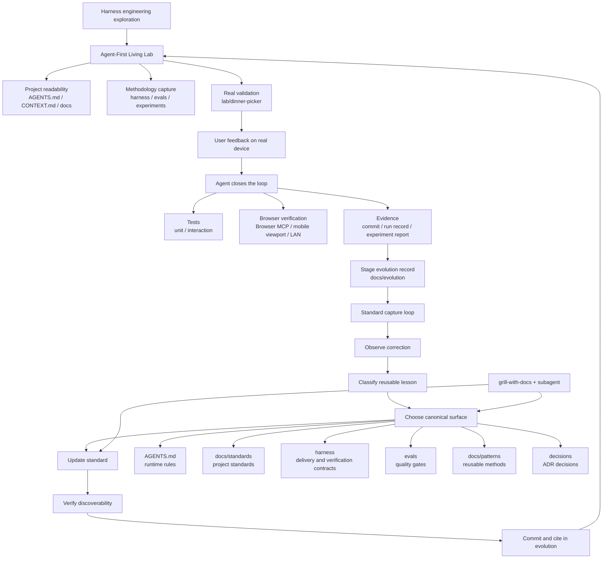

# Standard Capture Loop

> Priority: high.
>
> This is one of the core methodologies discovered during the lab validation
> phase. It should be preserved for future sharing and reuse.

## Problem

AI-agent projects do not only fail because code is wrong. They also fail when a
user repeatedly corrects the same class of agent behavior and the project does
not turn that correction into a durable rule.

If the lesson stays in chat, the next agent can repeat the mistake.

## Pattern

Turn meaningful corrections, review findings, failed runs, and repeated friction
into project standards.

The canonical executable process lives in
`../../harness/agent-learning-loop.md`. This pattern explains the shareable
method; the harness module owns the step-by-step loop.

Use this loop:

```text
observe correction -> classify lesson -> choose canonical surface ->
update standard -> verify discoverability -> commit -> cite in evolution
```

The broader project loop looks like this:



The short version:

```text
real feedback -> agent verification loop -> evidence capture ->
standard capture -> project evolution
```

## Classification

Before writing a new rule, classify the lesson:

- one-off execution mistake
- harness delivery rule
- directory or repository-structure standard
- documentation placement standard
- evaluation or quality-gate standard
- lab implementation standard
- runtime agent rule
- stage-level learning

Not every correction becomes a standard. The threshold is reuse:

```text
Would a future agent benefit from seeing this before repeating the mistake?
```

If yes, capture it.

## Canonical Surfaces

Use the smallest authoritative surface that future agents will actually read:

- `AGENTS.md`: runtime rule every agent must obey
- `docs/standards/`: cross-cutting project standards
- `harness/`: harness methodology, delivery contracts, adapters, run records
- `evals/`: rubrics, checklists, quality gates
- `docs/patterns/`: reusable methods and solution shapes
- `docs/evolution/`: stage-level narrative and shareable takeaway
- `decisions/`: durable trade-off decisions that should not be relitigated

When a rule crosses surfaces, update the owning standard and the relevant
indexes or maps. Avoid leaving a standard invisible.

## Use Of Skills And Subagents

Use `grill-with-docs` when the terminology, ownership, or documentation
placement is unclear.

Before relying on `grill-with-docs`, check whether the skill is available in the
current agent environment. If it is missing, tell the user how to install it
using the relevant note under `docs/tools/`, then continue with a lightweight
fallback review.

Use subagents when the standard touches multiple surfaces and a parallel review
can catch stale maps, wording drift, or missing canonical references.

The lead agent still owns the final integration.

For important standards work, use a cross-review shape:

```text
grill terminology and ownership -> subagent placement review ->
lead agent integrates -> verify discoverability -> commit
```

## Evidence Of Good Capture

A good capture has:

- a clear canonical term
- a rule future agents can follow
- an index or reader path that makes the rule discoverable
- verification that docs have no placeholders or stale wording
- a commit that explains why the standard exists
- an evolution note when the learning is stage-level or shareable

## Anti-Patterns

- only acknowledging the user's correction in chat
- updating an evolution note but not the standard future agents should follow
- putting every rule in `AGENTS.md`
- putting non-harness rules in `harness/`
- creating a standard for a one-off mistake
- failing to update indexes after adding a canonical surface

## Shareable Line

Harness learning becomes valuable when the project can teach the next agent not
to repeat the current agent's mistake.
